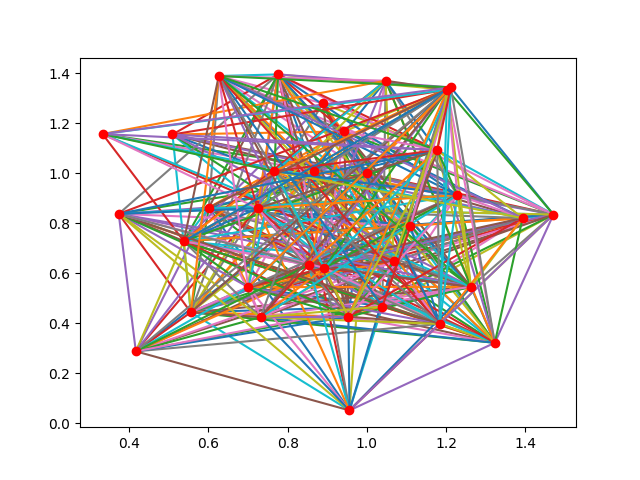

# Spring Mass Clustering

Implementation of spring mass simulation. Use cases include physics based 2d clustering algorithm.

## Examples:

### Network clustering:

<p align="center">
    
    
</p>

Visualizing clustering of social network from

````
Freeman, S.C., Freeman, L.C., 1979. The networkers network: A study of the impact of a new communications medium on sociometric structure. Social Science Research Reports 46. University of California, Irvine, CA.
````

### Physics simulation:

Amplitude  | Two Springs with one mass inline | Two springs with one mass in 2d space
: ------------- | ------------- | ------------- :
  |  | 
